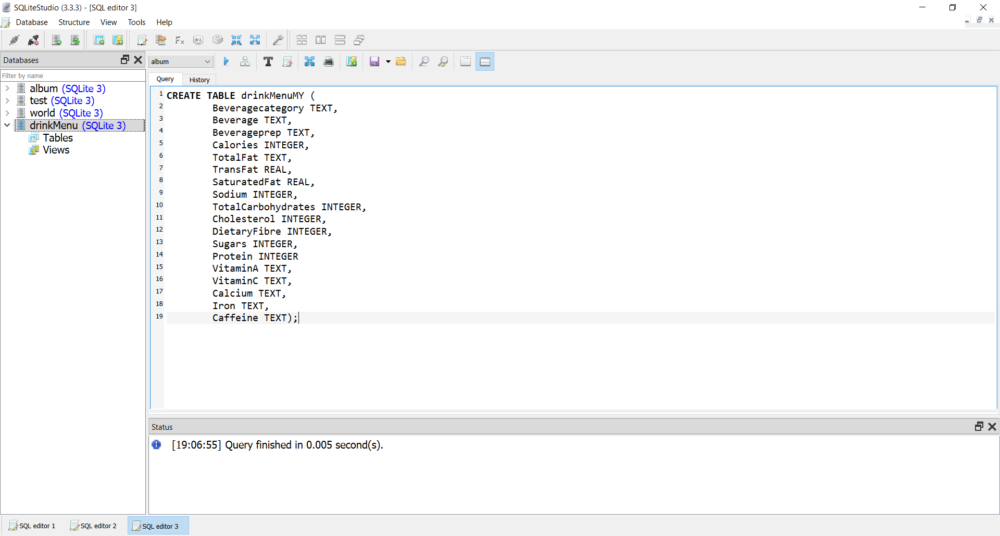
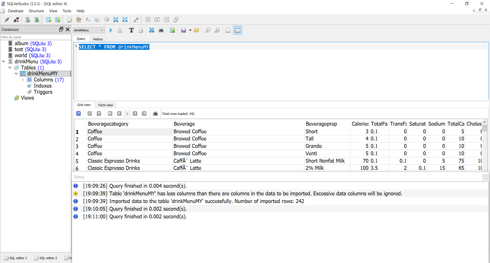
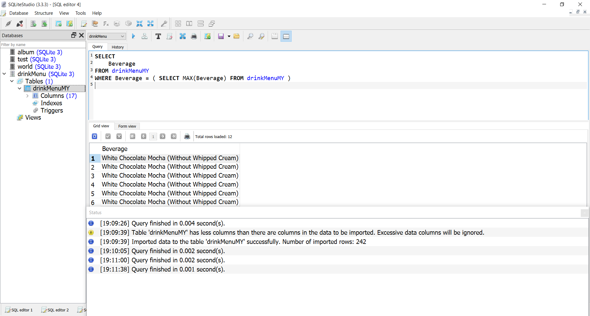
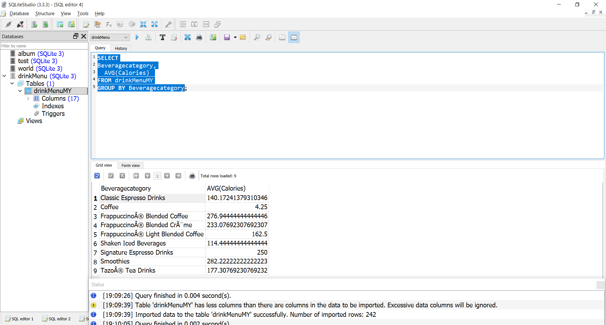
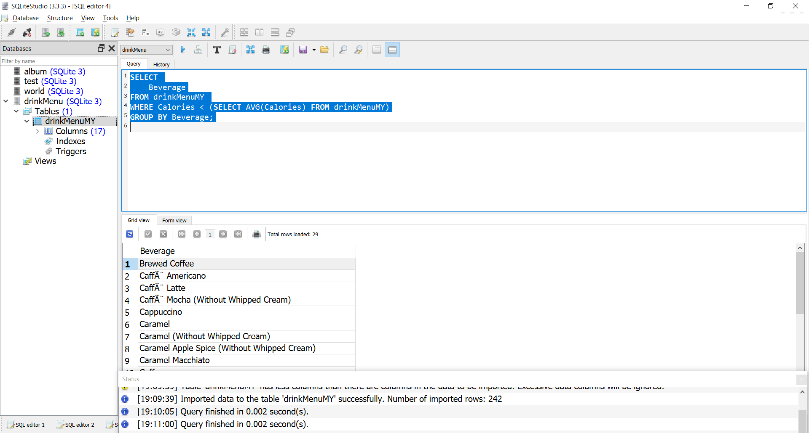

## Mahmoud Basha 
mahmoudbuiltin@gmail.com
Database task 
The queires are in the text file and the results are in the pdf. 
I used SQLite with SQLite studio for this task. 
The pdf file is same as the README.

#### Steps to reproduce output:  
1 – from the top left corner in SQLite studio Click on Database
to create a new database. I created database named -> 
drinkMenu 

2- Create table to house the data in the excel file by using the 
create table command  
CREATE TABLE drinkMenuMY (
 Beveragecategory TEXT,
 Beverage TEXT,
 Beverageprep TEXT,
 Calories INTEGER,
 TotalFat TEXT,
 TransFat REAL,
 SaturatedFat REAL,
 Sodium INTEGER,
 TotalCarbohydrates INTEGER,
 Cholesterol INTEGER,
 DietaryFibre INTEGER,
 Sugars INTEGER,
 Protein INTEGER
 VitaminA TEXT,
 VitaminC TEXT,
 Calcium TEXT,
 Iron TEXT,
 Caffeine TEXT);
 
 
 
 3 – import the excel file into the table by using the import tool. 
Tools -> import -> choose table to import into –> choose excel 
file to import from

Questions answers:
1. Which drink has the highest calories from the dataset ?
SELECT 
 Beverage
FROM drinkMenuMY 
WHERE Beverage = ( SELECT MAX(Beverage) FROM drinkMenuMY );

2 - What is the average calorie amount for each drink category 
?
SELECT
Beveragecategory,
 AVG(Calories) 
FROM drinkMenuMY
GROUP BY Beveragecategory;

3- Which drinks have below average calorie amount ?
SELECT 
 Beverage
FROM drinkMenuMY 
WHERE Calories < (SELECT AVG(Calories) FROM drinkMenuMY)
GROUP BY Beverage;

